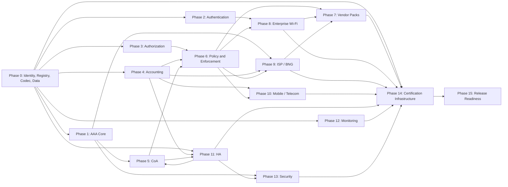

# Enterprise NAS/AAA Master Implementation Roadmap

Status: planning baseline derived from the repository audit and operational documentation. This document defines backlog and release governance only; it does not claim that any listed capability is implemented.

## Canonical roadmap artifacts

- `enterprise-nas-engineering-backlog.csv`: 135 feature work packages with the complete engineering contract requested for every capability.
- `enterprise-nas-implementation-sequence.csv`: dependency-resolved first-to-last execution order.
- `enterprise-nas-vendor-implementation-roadmap.csv`: all 195 audited FreeRADIUS 3.2.8 vendor namespaces assigned to a delivery wave and evidence gate.
- `freeradius-3.2.8-vsa-audit.csv`: attribute-level source ledger for all 7,654 attributes.
- `freeradius-3.2.8-vendor-matrix.csv`: current per-vendor compatibility baseline.
- `enterprise-nas-vendor-superset-audit.md`: audit findings, blockers, capability scores, and implementation contract.

The CSV backlog is authoritative when a summary in this document is less specific. Feature IDs are permanent. Dependencies may change only through an architecture decision record and backlog review.

## Source-of-truth set

The roadmap was reconciled against all audit, architecture, deployment, security, development, API, UI, HA, backup, upgrade, certification, and operations documents under `docs/`, including:

- The enterprise audit, vendor matrix, VSA ledger, capability framework, product implementation notes, architecture, development, and production-readiness documents.
- The admin API, external AAA mode, wireless UI, full AI engine, deployment profiles, hardware sizing, and edge-network operations documents.
- The security, operations, backup/restore, HA, upgrade/rollback, Ubuntu appliance/VM, VMware, login, RadSec, and vendor certification runbooks.

## Baseline and scope

| Measure | Audited baseline | Remaining |
|---|---:|---:|
| FreeRADIUS release | 3.2.8 at pinned commit | Automated release tracking required |
| Dictionary files | 246 | Every release delta must be classified |
| Vendor namespaces | 195 | 167 currently have no mapped attribute |
| Attributes | 7,654 | 7,513 missing; 141 partial |
| Raw mapped attributes | 1.842% | 98.158% |
| Weighted VSA completion | 0.921% | 99.079% |
| Vendor-superset score | 9.6% | 90.4% |
| Enterprise readiness | 38% | 62% |

The primary completion baseline is therefore **90.4% remaining for vendor-superset scope** and **62% remaining for enterprise production readiness**. Attribute counting alone is not a product-readiness score.

Dictionary presence is protocol vocabulary, not behavioral implementation. A feature is complete only when authoritative semantics, typed wire processing, policy, persistence, enforcement, API/UI, observability, migration, HA behavior, and applicable real-device evidence all exist.

Storage-NAS functionality is outside this AAA/NAS roadmap unless product governance explicitly adds it. Controller-only vendors or integrations outside the pinned FreeRADIUS corpus enter through `NAS-0073` and cannot silently inflate dictionary compatibility.

## Reconciled findings

1. The audit's older statement that RadSec is absent is superseded by the dedicated RadSec implementation document and updated capability assessment. X.509 RadSec is treated as partial; `NAS-0014`, `NAS-0123`, and `NAS-0113` cover TLS-PSK, rotation, interoperability, and production evidence.
2. The placeholder PEN `55555` remains a blocker. It must not be represented as an assigned production identity.
3. The scanner and packet path currently risk separate interpretations of dictionaries. The generated typed registry is the required single source of truth.
4. Current active/standby package and VIP procedures are useful operational slices, but they are not a replicated consensus cluster.
5. Current vendor/controller mappings remain partial until exact product, firmware, packet, enforcement, upgrade, and rollback evidence is attached.
6. FreeRADIUS SQL accounting compatibility, ISP/BNG, telecom/mobile, subscriber IPv6, route injection, TACACS+, key management, certification, performance, and support lifecycle are production blockers or major gaps.

## Backlog semantics

Priority:

- **Critical**: blocks correctness, security, data integrity, interoperability, HA, or production claims.
- **High**: required for enterprise completeness or a major vendor/capability family.
- **Medium**: required for superset breadth but can follow the production-critical path.
- **Low**: optional optimization; none are currently classified Low.

Complexity:

- **M**: approximately 3-6 engineer-weeks.
- **L**: approximately 2-4 engineer-months.
- **XL**: approximately 4-9 engineer-months and normally requires multiple disciplines or external lab access.

Current ledger distribution: 82 Missing and 53 Partial work packages; 81 XL, 47 L, and 7 M. A rough unadjusted range is 423-927 engineer-months. With four well-staffed parallel squads plus a certification lab, the planning horizon is approximately 30-60 calendar months. Phase 0 must replace this estimate with measured throughput and vendor-lab lead times.

## Definition of done

Every feature must satisfy all of these gates before its status becomes Complete:

1. Authoritative specification and dictionary provenance are recorded, including aliases, firmware scope, direction, cardinality, tags, grouping, units, and sensitive-data classification.
2. Typed encode/decode and malformed-input behavior have golden, negative, property, and fuzz tests.
3. Policy semantics define precedence, conflict behavior, tenant boundaries, and safe fallback.
4. Database migrations are forward/backward compatible and proven under HA, backup, restore, upgrade, and downgrade.
5. Versioned APIs and UI expose effective state, validation, preview, evidence, audit history, and stable errors.
6. Metrics, traces, logs, SLOs, rate limits, retention, and cardinality budgets are defined.
7. Security review covers secrets, authorization, privacy, abuse, cryptography, and dependency provenance.
8. Performance and resource-tier limits pass for Lite, Branch, and Enterprise profiles where applicable.
9. FreeRADIUS interoperability and exact vendor device/controller model and firmware tests pass where applicable.
10. Documentation, support matrix, migration, rollback, and operator recovery procedures are published.

## Capability phases

The phases are ownership lanes. The executable order is the dependency-resolved sequence CSV; teams must not start a feature until every listed dependency is Complete.

| Phase | IDs | Work packages | Objective | Exit gate |
|---|---|---:|---|---|
| 0 - Core Architecture | NAS-0001..0008 | 8 | Production identity, generated typed registry, evidence model, complete codec, secret provider, PostgreSQL | One wire/schema truth; no placeholder identity; reversible production migrations |
| 1 - AAA Core | NAS-0009..0016 | 8 | Hardened RADIUS, proxy, RadSec extensions, dynamic clients, durable routing/fallback | Lossless, bounded, observable transport under failure |
| 2 - Authentication | NAS-0017..0028 | 12 | MAB, AD, MFA, extensible EAP, TEAP, SIM/AKA, certificate and password lifecycle | Supported methods pass negative, failover, certificate, and supplicant tests |
| 3 - Authorization | NAS-0029..0034 | 6 | Typed policy engine, nested/versioned policy, simulation, service chains, TACACS+, tenant isolation | Deterministic decisions with explainability and hard isolation |
| 4 - Accounting | NAS-0035..0041 | 7 | SQL reconciliation, idempotency, counters, IPv6, correlation, spooling, charging/export | No duplicate/lost records under replay, failover, or rollover |
| 5 - CoA / Disconnect | NAS-0042..0047 | 6 | General DAC, retries, proxy/reverse routing, vendor actions, ownership, cluster handoff | Idempotent RFC 5176 behavior with verified session ownership |
| 6 - Policy and Enforcement | NAS-0048..0059 | 12 | ACL AST/compilers, firewall, QoS, VLAN/QinQ, routes/VRF, dual-stack pools, CGNAT, atomic rollback | Intent compiles losslessly and enforcement is transactional |
| 7 - Vendor Compatibility | NAS-0060..0073 | 14 | Certify current mappings, major vendor packs, long-tail program, external intake | Every claim has attribute and exact-device evidence |
| 8 - Enterprise Wi-Fi | NAS-0074..0081 | 8 | Hostapd VLANs, roaming, Passpoint, PPSK, controller lifecycle, RF/WIPS, safe portal | Enterprise access workflows survive roam, drift, failure, and rollback |
| 9 - ISP / BNG | NAS-0082..0091 | 10 | PPPoE, subscriber state, products/quota, addressing, BNG QoS, wholesale, DHCP security, routes, governance | Stateful dual-stack subscriber service passes scale and recovery tests |
| 10 - Mobile / Telecom | NAS-0092..0098 | 7 | Grouped AVPs, mobile sessions, charging, policy/QoS, WiMAX, DOCSIS, voice/VPN | Correlated sessions and charging records pass domain labs |
| 11 - High Availability | NAS-0099..0105 | 7 | Replicated DB, session state, quorum, conflict resolution, rolling schema, fencing/geo-DR | Partition-safe failover, stated RPO/RTO, mixed-version and restore proof |
| 12 - Monitoring | NAS-0106..0111 | 6 | Tracing, SLOs, bounded metrics, warehouse, topology/capacity, certified reports | Operators can detect, explain, and forecast failures without unsafe cardinality |
| 13 - Security | NAS-0112..0120 | 9 | Vault/HSM/TPM, rotation, MFA, FIPS profiles, supply chain, independent audit, privacy, DDoS, portal security | No unresolved Critical security defects; independent evidence attached |
| 14 - Certification | NAS-0121..0129 | 9 | Golden/fuzz corpus, FreeRADIUS, enterprise, BNG, telecom, performance, HA soak, integration contracts | Signed repeatable evidence for every supported claim |
| 15 - Release Readiness | NAS-0130..0135 | 6 | Support/EOL, compatibility catalog, release gates, installer/migrations, backup/DR, claim control | Release board accepts support scope, recovery proof, and zero Critical blockers |

## Phase feature index

- **Phase 0:** production PEN; typed registry; dictionary/alias profiles; evidence states; extended/grouped/tagged codec; bounded pass-through; secret provider; PostgreSQL.
- **Phase 1:** packet hardening; realm proxy; loop/attribute policy; accounting spool; dynamic clients; RadSec PSK/rotation; transport policy; local fallback.
- **Phase 2:** MAB; AD/Kerberos/winbind; identity HA; OTP challenge; WebAuthn; EAP framework; TEAP; EAP-FAST/PWD; SIM/AKA; machine/user correlation; certificate lifecycle; password/supplicant lifecycle.
- **Phase 3:** typed expressions; nested approvals; simulation; service chains; TACACS+; tenant delegation/isolation.
- **Phase 4:** SQL schema; idempotency/order; 64-bit counters; IPv6/routes; session correlation; ingest replay; charging/export.
- **Phase 5:** DAC; retry/Error-Cause; proxy/reverse CoA; vendor compiler; capability/ownership registry; cluster handoff.
- **Phase 6:** ACL AST and compilers; local firewall; hierarchical QoS; rate compiler; VLAN lifecycle; voice/data/QinQ; route/VRF; IPv4/IPv6 pools; CGNAT/NAT64; atomic rollback; routing integration.
- **Phase 7:** 141-current-mapping certification; Cisco; Aruba/HPE; Juniper/ERX/Extreme; Ruckus; Fortinet/Palo Alto; Meraki/UniFi/OpenWiFi; Cambium/TP-Link/D-Link; Huawei/H3C/ZTE; Nokia/Alcatel; MikroTik; switching; long-tail; intake.
- **Phase 8:** hostapd VLAN; 802.11r/k/v; Passpoint; DPSK/PPSK; controller lifecycle; RF/RRM/mesh; rogue/WIPS/location; CWA/portal.
- **Phase 9:** PPPoE; subscriber state; plans/bundles; quota/balance; address leases; BNG QoS; L2TP/wholesale; DHCP/Option 82; service routes/multicast; lawful governance/self-service.
- **Phase 10:** grouped telecom AVPs; APN/PDP/bearer; charging; PCRF/PCF policy; WiMAX; DOCSIS; voice/VPN/CDR.
- **Phase 11:** replicated DB; synchronous sessions; distributed ownership; membership/quorum; conflict failover; rolling schema; partitions/fencing/geo-DR.
- **Phase 12:** OpenTelemetry; SLOs; per-attribute metrics; event warehouse; topology/capacity; reports/exports.
- **Phase 13:** Vault/HSM/TPM; rotation; admin MFA; FIPS; SBOM/signing/provenance; external security test; privacy/residency; abuse/DDoS; secure portal.
- **Phase 14:** golden vectors; malformed/fuzz corpus; FreeRADIUS transport lab; enterprise hardware; BNG; telecom; performance; HA soak; API/integration contracts.
- **Phase 15:** support/EOL; compatibility publication; release gates; installer/update/downgrade; backup/DR; scope and claim governance.

## Master implementation checklist

- [x] NAS-0001 engineering implementation complete; external release evidence is tracked in `nas-0001-release-certification-checklist.md`.
- [x] NAS-0002 engineering implementation complete; external release evidence is tracked in `nas-0002-release-certification-checklist.md`.
- [x] NAS-0003 engineering implementation complete; external release evidence is tracked in `nas-0003-release-certification-checklist.md`.
- [x] NAS-0004 engineering implementation complete; external release evidence is tracked in `nas-0004-release-certification-checklist.md`.
- [x] NAS-0005 engineering implementation complete; external release evidence is tracked in `nas-0005-release-certification-checklist.md`.
- [x] NAS-0006 engineering implementation complete; external release evidence is tracked in `nas-0006-release-certification-checklist.md`.
- [x] NAS-0007 engineering implementation complete; external release evidence is tracked in `nas-0007-release-certification-checklist.md`.
- [x] NAS-0008 engineering implementation complete; external release evidence is tracked in `nas-0008-release-certification-checklist.md`.
- [x] Phase 0 exit gate accepted; NAS-0001..NAS-0008 Complete.
- [x] NAS-0009 engineering implementation complete; external release evidence is tracked in `nas-0009-release-certification-checklist.md`.
- [x] NAS-0010 engineering implementation complete; external release evidence is tracked in `nas-0010-release-certification-checklist.md`.
- [x] NAS-0011 engineering implementation complete; external release evidence is tracked in `nas-0011-release-certification-checklist.md`.
- [x] NAS-0012 engineering implementation complete; external release evidence is tracked in `nas-0012-release-certification-checklist.md`.
- [x] NAS-0013 engineering implementation complete; external release evidence is tracked in `nas-0013-release-certification-checklist.md`.
- [x] NAS-0014 engineering implementation complete; external release evidence is tracked in `nas-0014-release-certification-checklist.md`.
- [x] NAS-0015 engineering implementation complete; external release evidence is tracked in `nas-0015-release-certification-checklist.md`.
- [x] NAS-0016 engineering implementation complete; external release evidence is tracked in `nas-0016-release-certification-checklist.md`.
- [x] Phase 1 exit gate accepted; NAS-0009..NAS-0016 Complete.
- [x] NAS-0017 engineering implementation complete; external release evidence is tracked in `nas-0017-release-certification-checklist.md`.
- [x] NAS-0018 engineering implementation complete; external release evidence is tracked in `nas-0018-release-certification-checklist.md`.
- [x] NAS-0019 engineering implementation complete; external release evidence is tracked in `nas-0019-release-certification-checklist.md`.
- [x] NAS-0020 engineering implementation complete; external release evidence is tracked in `nas-0020-release-certification-checklist.md`.
- [x] NAS-0021 engineering implementation complete; external release evidence is tracked in `nas-0021-release-certification-checklist.md`.
- [x] NAS-0022 engineering implementation complete; external release evidence is tracked in `nas-0022-release-certification-checklist.md`.
- [x] NAS-0023 engineering implementation complete; external release evidence is tracked in `nas-0023-release-certification-checklist.md`.
- [x] NAS-0024 engineering implementation complete; external release evidence is tracked in `nas-0024-release-certification-checklist.md`.
- [x] NAS-0025 engineering implementation complete; external release evidence is tracked in `nas-0025-release-certification-checklist.md`.
- [x] NAS-0026 engineering implementation complete; external release evidence is tracked in `nas-0026-release-certification-checklist.md`.
- [x] NAS-0027 engineering implementation complete; external release evidence is tracked in `nas-0027-release-certification-checklist.md`.
- [x] NAS-0028 engineering implementation complete; external release evidence is tracked in `nas-0028-release-certification-checklist.md`.
- [x] Phase 2 exit gate accepted; NAS-0017..NAS-0028 Complete.
- [x] NAS-0029 engineering implementation complete; external release evidence is tracked in `nas-0029-release-certification-checklist.md`.
- [x] NAS-0030 engineering implementation complete; external release evidence is tracked in `nas-0030-release-certification-checklist.md`.
- [x] NAS-0031 engineering implementation complete; external release evidence is tracked in `nas-0031-release-certification-checklist.md`.
- [x] NAS-0032 engineering implementation complete; external release evidence is tracked in `nas-0032-release-certification-checklist.md`.
- [x] NAS-0033 engineering implementation complete; external release evidence is tracked in `nas-0033-release-certification-checklist.md`.
- [x] NAS-0034 engineering implementation complete; external release evidence is tracked in `nas-0034-release-certification-checklist.md`.
- [x] Phase 3 exit gate accepted; NAS-0029..NAS-0034 Complete.
- [x] NAS-0035 engineering implementation complete; external release evidence is tracked in `nas-0035-release-certification-checklist.md`.
- [x] NAS-0036 engineering implementation complete; external release evidence is tracked in `nas-0036-release-certification-checklist.md`.
- [ ] Phase 4 exit gate accepted; NAS-0035..NAS-0041 Complete.
- [ ] Phase 5 exit gate accepted; NAS-0042..NAS-0047 Complete.
- [ ] Phase 6 exit gate accepted; NAS-0048..NAS-0059 Complete.
- [ ] Phase 7 exit gate accepted; NAS-0060..NAS-0073 Complete.
- [ ] Phase 8 exit gate accepted; NAS-0074..NAS-0081 Complete.
- [ ] Phase 9 exit gate accepted; NAS-0082..NAS-0091 Complete.
- [ ] Phase 10 exit gate accepted; NAS-0092..NAS-0098 Complete.
- [ ] Phase 11 exit gate accepted; NAS-0099..NAS-0105 Complete.
- [ ] Phase 12 exit gate accepted; NAS-0106..NAS-0111 Complete.
- [ ] Phase 13 exit gate accepted; NAS-0112..NAS-0120 Complete.
- [ ] Phase 14 exit gate accepted; NAS-0121..NAS-0129 Complete.
- [ ] Phase 15 exit gate accepted; NAS-0130..NAS-0135 Complete.
- [ ] All 7,654 attribute rows are classified as Complete, Governed Pass-through, or Not Applicable with approved evidence.
- [ ] All 195 vendor rows have exact support scope and signed certification evidence or an approved Not Applicable decision.
- [ ] Lite, Branch, and Enterprise profiles meet published capacity, security, upgrade, backup, HA, and recovery criteria.
- [ ] No Critical blocker, unsupported compatibility claim, placeholder credential/identity, or unowned migration remains.

## Feature dependency graph

The apparent Phase 5/Phase 11 loop is split at feature level: base DAC and ownership (`NAS-0042..0046`) precede HA, while cluster handoff (`NAS-0047`) follows `NAS-0099`. The sequence CSV resolves this and all other cross-phase prerequisites without cycles.

## Suggested first-to-last execution

1. Establish production identity, secrets, generated dictionary registry, codecs, evidence states, PostgreSQL, and golden/fuzz infrastructure.
2. Harden UDP/TCP/RadSec transport, proxying, dynamic clients, routing policy, and durable spools.
3. Build the typed policy engine, accounting correctness, base CoA, ACL/QoS/VLAN/route primitives, and observability foundations.
4. Build authentication methods and certificate/identity lifecycle in dependency order.
5. Build replicated data, quorum, session ownership, rolling migrations, fencing, and recovery.
6. Complete cluster CoA and atomic enforcement after ownership is stable.
7. Deliver enterprise Wi-Fi shared primitives and controller object lifecycle.
8. Deliver ISP/BNG shared subscriber primitives.
9. Deliver telecom grouped attributes, session, charging, cable, WiMAX, and voice workflows.
10. Certify the 141 existing partial mappings, then implement major vendor packs on shared primitives.
11. Process all remaining namespaces through the typed long-tail program, ordered by customer demand, attribute count, security impact, and available hardware.
12. Finish security controls, capacity profiles, analytics, external integration contracts, and independent review.
13. Run FreeRADIUS, vendor hardware, BNG, telecom, performance, partition, rolling-upgrade, rollback, and 30-day soak certification.
14. Publish exact compatibility/support scope and permit release only through automated gates.

The exact 135-row topological order is in `enterprise-nas-implementation-sequence.csv` and is the execution authority.

## Vendor implementation roadmap

| Wave | Namespaces | Primary work | Certification |
|---|---:|---|---|
| E1-E8 major enterprise packs | 30 | Cisco; Aruba/HPE; Juniper/Extreme; Ruckus/ICX; security gateways; cloud access; SMB access; enterprise switching | NAS-0124 |
| E9 enterprise/security long tail | 19 | Typed access, ACL, Wi-Fi, posture, and security semantics | NAS-0072 and NAS-0124 |
| B1-B3 named broadband packs | 9 | Huawei/H3C/ZTE; Nokia/Alcatel; MikroTik | NAS-0125 |
| B4 broadband long tail | 14 | PPP, BNG, DHCP, subscriber, routing, QoS, and charging | NAS-0082..0091 and NAS-0125 |
| T1 named telecom/cable/voice | 13 | 3GPP/3GPP2, Ericsson, Starent, WiMAX, CableLabs, BroadSoft, Acme | NAS-0092..0098 and NAS-0126 |
| T2-T3 telecom/voice long tail | 35 | Mobile/core/charging and voice/VPN workflows | NAS-0092..0098 and NAS-0126 |
| L1 typed long tail | 73 | Remaining protocol namespaces, aliases, management, and vendor-specific semantics | NAS-0072, NAS-0121, NAS-0131 |

The 195-row vendor roadmap is exhaustive for the pinned audit corpus. Each row records PEN, audited capability families, current percentage/status, delivery wave, parent feature IDs, and required production evidence. A vendor reaches 100% only when every applicable attribute and the real behavior it enables pass the full definition of done. Unsupported, obsolete, duplicate, or non-NAS attributes require an approved Not Applicable decision rather than fabricated implementation.

## Dictionary implementation roadmap

| Capability family | Attributes | Owning feature groups |
|---|---:|---|
| Vendor-specific / other | 2,918 | NAS-0002..0006, NAS-0060..0073, NAS-0121 |
| ISP / broadband / subscriber | 1,058 | NAS-0032, NAS-0051..0059, NAS-0082..0091 |
| Accounting / session | 513 | NAS-0035..0041, NAS-0100 |
| Mobile / core / charging | 404 | NAS-0092..0098 |
| Bandwidth / QoS | 396 | NAS-0051..0052, NAS-0087, vendor packs |
| Authorization / policy | 371 | NAS-0029..0034, vendor packs |
| IP addressing / routing | 368 | NAS-0038, NAS-0055..0059, NAS-0086..0090 |
| NAS / device management | 355 | NAS-0013, NAS-0046, NAS-0078, NAS-0110 |
| Voice / telephony | 335 | NAS-0039, NAS-0041, NAS-0098 |
| Authentication | 308 | NAS-0017..0028 |
| Security / VPN / posture | 243 | NAS-0033, NAS-0065, NAS-0112..0120 |
| Captive / hotspot / guest | 95 | NAS-0076, NAS-0081, NAS-0084..0085, NAS-0120 |
| Tenant / location | 83 | NAS-0034, NAS-0080, NAS-0118 |
| 802.1X / Wi-Fi | 82 | NAS-0017, NAS-0022..0028, NAS-0074..0081 |
| ACL / firewall | 72 | NAS-0048..0050, NAS-0061..0072 |
| Dynamic authorization | 53 | NAS-0042..0047 |

Dictionary processing order for each pinned release:

1. Fetch and cryptographically pin the upstream release and manifest all 246 files.
2. Parse vendor declarations, includes, aliases, types, tags, groups, enums, encryption flags, and duplicate/redefinition behavior into the generated registry.
3. Diff added, removed, renamed, and type-changed attributes; block unreviewed wire changes.
4. Classify every attribute by semantic, direction, capability family, security class, and applicability.
5. Generate codecs, schemas, API metadata, UI metadata, metrics metadata, and golden-vector skeletons from one registry.
6. Implement product behavior through the owning feature work package; never infer behavior from a name alone.
7. Certify with FreeRADIUS and exact vendor models/firmware, then publish evidence state.

## RFC and standards roadmap

| Standard | Scope | Feature IDs | Completion evidence |
|---|---|---|---|
| RFC 2865 / 2866 / 2868 | Authentication, accounting, tunneling/VLAN | NAS-0002..0006, 0009..0013, 0035..0041, 0053..0054 | Golden packets, FreeRADIUS interop, duplicate/replay and VLAN device tests |
| RFC 3162 / 6911 / 8415 | IPv6 RADIUS, delegated prefixes, DHCPv6 | NAS-0038, 0055..0056, 0086 | Dual-stack subscriber and failover evidence |
| RFC 3748 / 5216 / 7170 / 4851 / 5931 | EAP, EAP-TLS, TEAP, EAP-FAST, EAP-PWD | NAS-0022..0028 | Supplicant, method chaining, PAC, password-proof, certificate, downgrade, and negative tests |
| RFC 4186 / 4187 / 5448 | EAP-SIM/AKA/AKA' | NAS-0025, 0092..0095 | SIM/mobile lab and identity privacy tests |
| RFC 5176 | CoA and Disconnect | NAS-0042..0047, 0058, vendor packs | ACK/NAK, Error-Cause, retries, ownership, proxy, cluster tests |
| RFC 5997 / 6614 / 9765 / 9813 | Status and secure RADIUS transports | NAS-0007, 0009, 0014..0015, 0123 | X.509/PSK, rotation, downgrade prevention, vendor interop |
| RFC 2516 / 2661 / 3046 | PPPoE, L2TP, DHCP relay information | NAS-0082, 0088..0089 | BNG/relay packet and recovery tests |
| RFC 4271 / 2328 | BGP/OSPF route integration | NAS-0059, 0090 | Route ownership, withdrawal, convergence, partition tests |
| RFC 6146 / 6888 | NAT64 and CGN requirements | NAS-0057 | Deterministic mapping, scale, logging, privacy, failover tests |
| RFC 8907 | TACACS+ | NAS-0033, 0098 | Command authorization/accounting and device interop |
| RFC 8910 | Captive portal indication | NAS-0081, 0120 | Per-session portal, consent, privacy, and CoA tests |
| RFC 5280 / 7030 / 8894 | PKI, EST, SCEP | NAS-0027, 0113 | Issue, renew, revoke, CRL/OCSP, rotation, recovery tests |
| IEEE 802.1X / 802.11 / 802.11u / 802.16 | Wired/wireless access, Passpoint, WiMAX | NAS-0017, 0022..0028, 0074..0080, 0096 | Certified supplicant, AP/controller, roaming, and domain labs |
| 3GPP TS 23.401 / 23.203 / 32.240 | Mobile session, policy, charging | NAS-0093..0095 | Mobile state, roaming, policy, and charging correlation evidence |
| FIPS 140-3 / SLSA / OWASP ASVS / OpenAPI / W3C Trace Context | Crypto, supply chain, application security, API, tracing | NAS-0106, 0115..0117, 0129 | Independent validation, signed provenance, contract and trace tests |

Standards without direct RFCs use their authoritative industry specification or an approved internal architecture/security contract. Standards revisions are pinned just like dictionaries.

## Release trains and production gates

| Train | Included capability | Release condition |
|---|---|---|
| R0 Foundation | Phase 0 plus certification infrastructure prerequisites | Registry/codec/data migrations are deterministic, reversible, and signed |
| R1 Enterprise AAA core | Core RADIUS/proxy/RadSec, accounting, policy, base CoA, auth, HA, security | FreeRADIUS interop, partition tests, stated SLOs, no Critical defects |
| R2 Enterprise access | ACL/QoS/VLAN, Wi-Fi shared primitives, first enterprise vendor packs | Exact AP/switch/controller firmware evidence and safe rollback |
| R3 Broadband | PPPoE/subscriber/BNG, broadband packs | Dual-stack scale, charging, route, DHCP, CoA, HA, and recovery evidence |
| R4 Telecom and long tail | Mobile/cable/voice and remaining namespaces | Domain-lab evidence or approved Not Applicable classification |
| R5 Superset certification | All applicable attributes/vendors | 30-day soak, upgrade/downgrade/DR, security audit, signed compatibility catalog |

## Governance and progress calculation

Progress is recalculated from evidence, not task opinion:

- **Attribute completion:** weighted Complete attributes divided by applicable attributes. Partial mappings do not count as Complete.
- **Vendor compatibility:** weighted Complete applicable attributes plus certified workflows for that exact model/firmware.
- **Enterprise readiness:** Critical production gates passed divided by applicable Critical gates, with any unresolved Critical blocker capping the score below release.
- **Superset completion:** the audit's cross-domain model rerun from the generated registry and evidence database.

The scanner must regenerate the VSA ledger, vendor matrix, roadmap deltas, and release blockers on every pinned FreeRADIUS upgrade. Manual percentages are prohibited in release claims.

## Immediate planning order

1. Approve scope, feature-ID governance, evidence states, and Not Applicable policy.
2. Start the IANA PEN process; retain `55555` only as an explicitly labeled lab namespace.
3. Staff Phase 0, certification infrastructure, security, and vendor-lab procurement in parallel.
4. Convert the 135 feature rows into tracked epics without changing IDs or acceptance criteria.
5. Assign architecture, backend, packet, policy, data, API/UI, SRE, security, documentation, and lab owners to every Critical row.
6. Establish quarterly FreeRADIUS pin/update cadence and acquire representative hardware for E1, E2, E3, B1, B2, and T1 waves.
7. Begin implementation only after the Phase 0 design review and migration/rollback test plan are approved.
